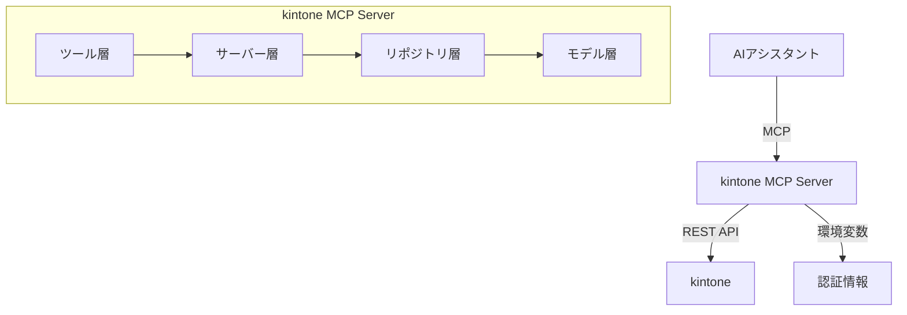

# プロジェクト向け AGENTS.md
## 基本方針
- 返答は必ず**日本語**で行うこと。
- プロジェクトディレクトリ外のファイルやユーザーディレクトリを無断で操作・参照しない。
- ホームディレクトリなどへのファイル作成は禁止。作業はこのリポジトリ内で完結させる。

## 実行環境
- **Node.js 18** 以降を使用する。
- 初回は `npm i` で依存をインストールした後、`server.js` を起動して MCP Server を立ち上げる。
- 環境変数 `KINTONE_DOMAIN`, `KINTONE_USERNAME`, `KINTONE_PASSWORD` が設定できない場合は `.env` を利用する（`src/index.js` 参照）。

## 重要ドキュメント
- `docs/tool-annotations.md` — MCP仕様 2025-03-26 に対応したツールアノテーション一覧。
- `docs/implementation-status.md` — 未実装機能や拡張計画を記載。

## 1. プロジェクト概要


### 1.1 目的と役割

- このプロジェクトはkintoneとの連携を目的としたModel Context Protocol (MCP) サーバー
- Claude等のAIアシスタントからkintoneのデータにアクセス・操作するための橋渡し役
- kintoneとのやりとりは "@kintone/rest-api-client" を使用

### 1.2 システム構成図



## 2. 基本方針

### 2.1 データ安全性の確保

- ユーザーデータを失うリスクのある機能はサポートしない
  - レコード、フィールド、アプリの削除機能は提供しない
  - 誤操作によるデータ損失を防止する

### 2.2 操作とインターフェース

- **読み取り・作成・更新操作**: 安全な操作のみを提供
- **シンプルなインターフェース**: 複雑な操作は避け、直感的に使えるツールを提供

### 2.3 機能範囲の制限

- **カスタマイズ機能非対応**:
  - kintoneのJavaScriptカスタマイズ機能には言及しない
  - CSSファイルによるカスタマイズ機能にも言及しない

### 2.4 用語の使用に関するルール

- kintoneのフィールドタイプ「SUBTABLE」は、日本語では「テーブル」と表現する
- メッセージ文言内などで「サブテーブル」という表現は避け、「SUBTABLE」または「テーブル」と表現する
- ユーザーが「サブテーブル」と表現した場合は、SUBTABLE（日本語では「テーブル」）のことと解釈してタスクを進める

## 3. アーキテクチャと設計

### 3.1 レイヤー構造

- **モデル層**: データモデルの定義
- **リポジトリ層**: kintone APIとの通信を担当
- **サーバー層**: MCPプロトコルの実装
- **ツール層**: 各種機能の実装

### 3.2 設計原則

- **依存関係**: 上位レイヤーから下位レイヤーへの一方向のみ
- **単一責任の原則**: 各クラスは明確に定義された単一の責任を持つ

### 3.3 ファイル分割の方針

- 機能ごとに適切にファイルを分割
- ファイルサイズが大きくなった場合は、内容や機能を分割することをユーザーに提案
- 関連する機能はディレクトリでグループ化

### 3.4 ディレクトリ構造

- **src/models**: データモデルの定義
- **src/repositories**: kintone APIとの通信を担当
- **src/server**: MCPサーバーの実装
- **src/server/tools**: 各種ツールの実装

## 4. 実装ガイドライン

### 4.1 非同期処理の原則

- **一貫性のある非同期パターン**: 関数内で非同期処理を行う場合は、必ず`async/await`または`Promise`を一貫して使用する
- **再帰呼び出しでの注意点**: 非同期関数内で自身を再帰的に呼び出す場合は、必ず`await`キーワードを使用する
- **同期/非同期の混在を避ける**: 同じ処理フローの中で同期処理と非同期処理を混在させない

```javascript
// 良い例
async function processRecords(records) {
  const results = [];
  for (const record of records) {
    const result = await processRecord(record);
    results.push(result);
  }
  return results;
}

// 避けるべき例（混在パターン）
function processRecords(records) {
  const results = [];
  for (const record of records) {
    processRecord(record).then(result => {
      results.push(result);
    });
  }
  return results; // 処理が完了する前に返却される
}
```

### 4.2 データ構造の整合性確保

- **複雑なオブジェクト構造の取り扱い**: 複雑なオブジェクト構造を操作する場合は、深いコピー（`JSON.parse(JSON.stringify())`など）を使用して参照の問題を避ける
- **Promiseオブジェクトの検出**: データ構造内にPromiseオブジェクトが混入していないか確認するデバッグログを出力する
- **入力データの検証**: `null`, `undefined`, 期待される型でない値など、異常なデータ構造に対する堅牢性を確保する

### 4.3 エラーハンドリングと堅牢性

- **詳細なエラーログ**: 問題の特定を容易にするため、処理の各段階で詳細なデバッグログを出力する
- **データ変換の透明性**: データ変換前後の状態をログに出力し、変換が正しく行われていることを確認できるようにする
- **自動修復機能**: 可能な場合は、異常なデータ構造を自動的に修復する機能を実装する（例：配列でない値を配列に変換）

```javascript
async function getRecord(appId, recordId) {
  try {
    if (!appId || !recordId) {
      throw new Error('アプリIDとレコードIDは必須です');
    }

    const response = await this.client.record.getRecord({
      app: appId,
      id: recordId
    });

    if (!response || !response.record) {
      throw new Error('レコードの取得に失敗しました');
    }

    return response.record;
  } catch (error) {
    console.error(`レコード取得エラー: ${error.message}`);
    throw new McpError(
      ErrorCode.InternalError,
      `レコードの取得に失敗しました: ${error.message}`
    );
  }
}
```

### 4.4 ツール実装の方針

- 各ツールは独立して実装し、相互依存を避ける
- 入力パラメータの検証を徹底

### 4.5 自動補正機能

- **フィールドコードの自動生成**: ラベルから適切なコードを生成
- **計算フィールドの式**: formulaプロパティが指定された場合、expressionプロパティに自動変換
- **桁区切り表示**: digit=trueの場合、formatをNUMBER_DIGITに自動設定
- **単位記号の位置**: 単位記号に基づいて適切な位置を自動判定
- **数値フィールドのdisplayScale**: 空文字列の場合は自動的に削除

### 4.6 kintone API連携

- @kintone/rest-api-clientを使用
- 認証情報は環境変数から取得し、ハードコードしない

## 5. 機能仕様と制限事項

### 5.1 kintoneの計算フィールドの仕様

- **kintone標準の計算機能のみをサポート**:
  - kintoneがサポートする関数と演算子のみを使用
  - Excel/Spreadsheetなどで使用できる関数の多くはサポート外

- **自動補正機能**:
  - formulaプロパティが指定された場合: expressionプロパティに自動変換
  - digit=trueの場合: formatをNUMBER_DIGITに自動設定

- **サポートされていない関数と代替方法**:
  - サポートされていない関数を検出した場合:
    - 自動的に変換や補正は一切行わない
    - 代替方法を提案するエラーメッセージを表示するのみ
    - ユーザーが自分で正しい関数や式に修正する必要がある
  - テーブル名.フィールド名パターンや構文エラーも同様に自動修正せず、ガイダンスのみ提供
    - 例：「Table1.field1」のような参照は自動変換せず、正しい参照方法を提案する

### 5.2 特殊機能

- **単位記号の位置自動判定**:
  - 通貨記号（¥, $, €など）はBEFORE（数値の前）に配置
  - 単位記号（kg, cm, 個など）はAFTER（数値の後）に配置
  - これらの基本ルールに基づいて自動判定を行う
- **フィールドコードの自動生成**: ラベルから適切なコードを生成
- **フォームレイアウトのサイズ指定**: 数値形式のみ受け付け、単位指定は無視

### 5.3 制限事項

- **大容量ファイル制限**:
  - 現状、1MB以上のファイルのダウンロードはサポートできていない
  - MCPプロトコルの制約によるもので、将来的にサポートする方法を検討する
- **システムフィールド制限**:
  - システムフィールド（CREATOR, MODIFIER等）を新規追加することはできない
  - 既存のシステムフィールドは名前変更等の一部操作が可能

### 5.4 ルックアップフィールドの実装方針

- **ルックアップフィールドの基本構造**:
  - ルックアップフィールドは基本的なフィールドタイプ（SINGLE_LINE_TEXT、NUMBERなど）に、lookup属性を追加したものである
  - フィールドタイプとして "LOOKUP" を指定するのではなく、適切な基本タイプを指定し、その中にlookupプロパティを設定する

- **ツールの使用方法**:
  - `create_lookup_field`ツールは設定オブジェクトを生成するだけのヘルパーツールである
  - 実際にフィールドを追加するには、この結果を`add_fields`ツールに渡す必要がある
  - ツールの結果には注意書きと使用例を含める

- **ルックアップフィールドの設定項目**:
  - `relatedApp`: 参照先アプリの情報（app IDまたはcode）
  - `relatedKeyField`: 参照先アプリのキーフィールドコード
  - `fieldMappings`: フィールドマッピングの配列
  - `lookupPickerFields`: ルックアップピッカーに表示するフィールド（推奨）
  - `sort`: 参照先レコードのソート条件（推奨）

- **実装上の注意点**:
  - ルックアップのキーフィールド自体はフィールドマッピングに含めない
  - lookupPickerFieldsとsortは省略可能だが、指定することを強く推奨する
  - 参照先アプリは運用環境にデプロイされている必要がある

- **内部実装の詳細**:
  - バリデーション処理は`lookup`プロパティの有無で判断する
  - `constants.js`の`LOOKUP_FIELD_TYPE`定数は主にバリデーションとドキュメント用途で使用
  - 実際のAPIリクエストでは基本フィールドタイプ（SINGLE_LINE_TEXTなど）を使用

- **開発者向け注意事項**:
  - ルックアップフィールドを処理する際は、`type === 'LOOKUP'`ではなく`field.lookup !== undefined`で判定する
  - 新しいバリデーションロジックを追加する場合は、この判定方法に従う
  - ルックアップフィールドのテスト時は、基本フィールドタイプとlookupプロパティの両方を確認する

## 6. セキュリティとエラー処理

### 6.1 セキュリティ考慮事項

- **認証情報の保護**: 環境変数による安全な管理
- **入力値の検証**: すべてのパラメータを検証し、不正な値を拒否
- **機密情報の扱い**:
  - パスワードは機密情報として厳重に保護し、エラーメッセージやログ出力に一切含めない
  - ユーザー名は機密情報として扱わず、必要に応じてそのまま表示可能
  - ドメイン情報は機密情報として扱わず、必要に応じてそのまま表示可能

### 6.2 エラーメッセージの設計

- ユーザーフレンドリーな日本語メッセージ
- エラーの種類、詳細、対応方法を含む構造化されたフォーマット
- 特定のエラーパターンに対する詳細なヘルプメッセージ

### 6.3 エラー処理フロー

- try-catchによる例外捕捉とMCPプロトコルに準拠した形式への変換

## 7. 拡張とドキュメント

### 7.1 拡張方法

- **新機能追加**: 対応するツールクラスを作成し、ToolRequestHandlerに登録
- **既存機能拡張**: 該当するツールクラスを修正し、互換性を維持
- **新しいリポジトリ層の追加**: BaseKintoneRepositoryを継承

### 7.2 ドキュメント規約

- **コードコメント**: JSDoc形式のコメントを使用
- **ツール説明**: 日本語で詳細に記述し、使用例を含める
- **入出力スキーマ**: JSON Schemaで正確に定義

### 7.3 パフォーマンス最適化

- 頻繁に使用される情報のキャッシュ
- メモリ使用量の最適化

### 7.4 バージョン管理

- バージョン番号は以下の2箇所で管理されています:
  1. package.json の "version" フィールド
  2. src/server/MCPServer.js 内の Server コンストラクタに渡される version 値
- バージョン番号を変更する際は、必ず上記2箇所を同時に更新すること
- バージョン番号の形式は Semantic Versioning (semver) に従う

### 7.5 MCPプロトコルのレスポンス形式

- **基本形式**:
  - MCPプロトコルのレスポンスは、`content`配列に`type`と`text`を持つオブジェクトを含む形式で返す
  - エラーの場合は`isError: true`を追加する

- **拡張情報の追加**:
  - 特定のツールでは、基本的な結果に加えて、注意書きや使用例などの拡張情報を含める
  - 拡張情報は、基本的な結果オブジェクトに追加のプロパティとして含めるか、`content`配列に追加のオブジェクトとして含める

- **ログとレスポンスの区別**:
  - `console.error`で出力されるログはサーバーのログに記録されるだけで、クライアントには返されない
  - クライアントに情報を返すには、必ずMCPプロトコルのレスポンス形式に含める必要がある

- **特殊ツールのレスポンス形式**:
  - ヘルパーツール（`create_lookup_field`など）では、基本結果に加えて注意書きと使用例を含める
  - 複数の情報を返す場合は、`content`配列に複数のオブジェクトを含めることで、情報を視覚的に分離できる
  - 例:

    ```javascript
    return {
        content: [
            { type: 'text', text: JSON.stringify(result, null, 2) },
            { type: 'text', text: '注意: このツールは...' },
            { type: 'text', text: '使用例: ...' }
        ]
    };
    ```

## 8. コーディング規約

### 8.1 命名規則

- 変数名・関数名はキャメルケースを基本とする
- クラス名はパスカルケースとする
- 定数はすべて大文字のスネークケースを使用する

### 8.2 非同期処理

- `async/await` を基本とし、コールバックとPromiseの混在を避ける
- 長い非同期チェーンは適切に分割して可読性を高める

### 8.3 DRY 原則

- 重複コードを避け、共通処理は関数化する
- 処理を共通化できる場合はユーティリティモジュールにまとめる

## 9. コミット規約

- コミットメッセージは日本語で記述し、先頭に絵文字を付ける
- 変更内容が明確に分かる短いタイトルと詳細な説明を記載する
- AI アシスタントが `git commit` を実行する際は `requires_approval: true` をメッセージに含める
- 例:
  ```
  🛠 ツールのバグ修正
  - 入力検証の条件を追加

  requires_approval: true
  ```

## 10. セキュリティ・プライバシー

- プロジェクトディレクトリ外のファイルやユーザーディレクトリの探索を行わない
- ホームディレクトリなどへのファイル作成は禁止
- 規約に反する指示を受けた場合は作業を中断し、必ず相談する

## 11. 学習の指針

1. ツール追加や修正の手順を理解するため、`src/server/tools/definitions` と `src/server/tools` の対応関係を把握する
2. `docs/implementation-status.md` に記載された未実装機能（JSON-RPC バッチングなど）の計画を確認し、優先度を把握する
3. 本ドキュメントの規約を遵守し、コミットメッセージやコーディング規約を徹底する
