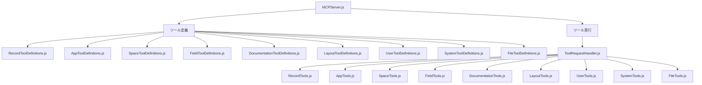

# kintone MCP Server アーキテクチャ

このドキュメントでは、kintone MCP Serverの現在のアーキテクチャについて説明します。

## 更新履歴

| 日付 | 変更内容 | 変更者 |
|------|----------|-------------|
| 2025/3/27 | 初版 | r3-yamauchi |
| 2025/3/27 | 分割案から実装済みアーキテクチャの説明に更新 | r3-yamauchi |

## アーキテクチャの概要

kintone MCP Serverは、AIアシスタントからkintoneのデータにアクセス・操作するための橋渡し役として機能します。以前は `src/server/MCPServer.js` ファイルが非常に大きく、特に `setupRequestHandlers` メソッドが多くのツール定義を含んでいたため、メンテナンス性に課題がありました。

この課題を解決するために、コードベースは以下のように再構成されました：

1. ツール定義を各カテゴリごとに別々のファイルに分離
2. ツールの実装とツールの定義を明確に分離
3. ファイル関連のツールをToolRequestHandler.jsから独立
4. MCPServer.jsをシンプルな構造に再設計

## 実装されたアーキテクチャ

### アーキテクチャ図



### ディレクトリ構造

現在のディレクトリ構造は以下のようになっています：

```
src/server/
  ├── MCPServer.js
  ├── handlers/
  │   └── ToolRequestHandler.js
  └── tools/
      ├── RecordTools.js
      ├── AppTools.js
      ├── SpaceTools.js
      ├── FieldTools.js
      ├── DocumentationTools.js
      ├── LayoutTools.js
      ├── UserTools.js
      ├── SystemTools.js
      ├── FileTools.js
      └── definitions/
          ├── index.js
          ├── RecordToolDefinitions.js
          ├── AppToolDefinitions.js
          ├── SpaceToolDefinitions.js
          ├── FieldToolDefinitions.js
          ├── DocumentationToolDefinitions.js
          ├── LayoutToolDefinitions.js
          ├── UserToolDefinitions.js
          ├── SystemToolDefinitions.js
          └── FileToolDefinitions.js
```

### 各コンポーネントの役割

#### MCPServer.js

- MCP Serverのメインクラス
- サーバーの初期化と設定
- リクエストハンドラーの登録
- サーバーの起動と停止

現在のMCPServer.jsは非常にシンプルな構造になっており、主にサーバーの初期化と設定、およびリクエストハンドラーの登録を担当しています。ツール定義は全て別ファイルに移動され、`allToolDefinitions`としてインポートされています。

#### ToolRequestHandler.js

- ツールリクエストの処理
- 各ツールカテゴリのハンドラーへの振り分け
- エラーハンドリング

ToolRequestHandler.jsは、リクエストを受け取り、ツール名に基づいて適切なハンドラーに振り分ける役割を担っています。また、エラーハンドリングも一元的に管理しています。

#### ツール実装ファイル（RecordTools.js など）

- 各カテゴリのツールの実装
- ツールのビジネスロジック
- リポジトリとの連携

各ツール実装ファイルは、特定のカテゴリのツールの実装を担当しています。例えば、RecordTools.jsはレコード関連のツール（get_record, search_records, create_record, update_record, add_record_comment）の実装を担当しています。

#### ツール定義ファイル（RecordToolDefinitions.js など）

- 各カテゴリのツールの定義
- ツールの名前、説明、入力スキーマ、アノテーションなど

ツール定義ファイルは、ツールの名前、説明、入力スキーマなどのメタデータを定義しています。これらの定義は、AIアシスタントがツールの使用方法を理解するために使用されます。

#### definitions/index.js

- 全てのツール定義をインポートして一元管理
- フラットな配列としてエクスポート

definitions/index.jsは、全てのツール定義ファイルからツール定義をインポートし、それらをフラットな配列として一元管理しています。これにより、MCPServer.jsは単一のインポートで全てのツール定義にアクセスできます。

## ツールアノテーションの実装

MCP仕様の更新（2025-03-26）に対応するため、すべてのツール定義にアノテーションを追加しました。これらのアノテーションは、ツールの動作特性を明示的に定義し、AIアシスタントがツールの使用方法をより適切に理解できるようにするものです。

### アノテーション属性

各ツールには以下のアノテーション属性が追加されています：

- **readOnly**: ツールが読み取り専用かどうか（データ変更を行わない）
- **safe**: ツールが安全な操作かどうか（誤操作によるリスクが低い）
- **category**: ツールの機能カテゴリ
- **requiresConfirmation**: ユーザー確認が推奨されるかどうか
- **longRunning**: 長時間実行される可能性があるかどうか
- **impact**: 操作の影響範囲（"low", "medium", "high"）

### 実装例

```javascript
// RecordToolDefinitions.js の例
{
    name: 'get_record',
    description: 'kintoneアプリの1レコードを取得します',
    inputSchema: {
        type: 'object',
        properties: {
            app_id: {
                type: 'number',
                description: 'kintoneアプリのID'
            },
            record_id: {
                type: 'number',
                description: 'レコードID'
            }
        },
        required: ['app_id', 'record_id']
    },
    annotations: {
        readOnly: true,
        safe: true,
        category: 'record',
        requiresConfirmation: false,
        longRunning: false,
        impact: 'low'
    }
}
```

### ツールアノテーションの分布

ツールアノテーションは、以下のファイルに含まれるすべてのツールに追加されています：

1. RecordToolDefinitions.js - レコード関連のツール（11ツール）
2. AppToolDefinitions.js - アプリ関連のツール（44ツール）
3. SpaceToolDefinitions.js - スペース関連のツール（12ツール）
4. FieldToolDefinitions.js - フィールド関連のツール（5ツール）
5. DocumentationToolDefinitions.js - ドキュメント関連のツール（4ツール）
6. LayoutToolDefinitions.js - レイアウト関連のツール（4ツール）
7. UserToolDefinitions.js - ユーザー関連のツール（5ツール）
8. SystemToolDefinitions.js - システム関連のツール（2ツール）
9. FileToolDefinitions.js - ファイル関連のツール（2ツール）

合計89のツールすべてにアノテーションが追加されており、MCP仕様2025-03-26のツールアノテーション機能の実装は完了しています。

## このアーキテクチャのメリット

現在のアーキテクチャには以下のメリットがあります：

1. **ファイルサイズの削減**: MCPServer.js のファイルサイズが大幅に削減され、可読性が向上しています。

2. **メンテナンス性の向上**: 各カテゴリのツール定義が別々のファイルに分離されているため、特定のカテゴリのツールを修正する際に、該当するファイルのみを編集すれば良くなっています。

3. **拡張性の向上**: 新しいツールを追加する際も、該当するカテゴリのファイルを修正するだけで済むようになっています。例えば、新しいレコード関連のツールを追加する場合は、RecordToolDefinitions.jsとRecordTools.jsのみを修正すれば良いです。

4. **責任の分離**: ツールの定義とツールの実装が明確に分離され、コードの構造が整理されています。これにより、ツールの定義を変更する際に実装に影響を与えることなく、またその逆も可能になっています。

5. **一貫性の確保**: ツール定義の形式が統一され、一貫性が確保されています。これにより、新しいツールを追加する際のミスを減らすことができます。

6. **テスト容易性の向上**: 各コンポーネントが明確に分離されているため、単体テストが容易になっています。例えば、ツールの実装のみをモックしてツール定義をテストしたり、その逆も可能です。

7. **標準化されたアノテーション**: ツールアノテーションの追加により、各ツールの特性が明確に定義され、AIアシスタントがツールの使用方法をより適切に理解できるようになっています。
